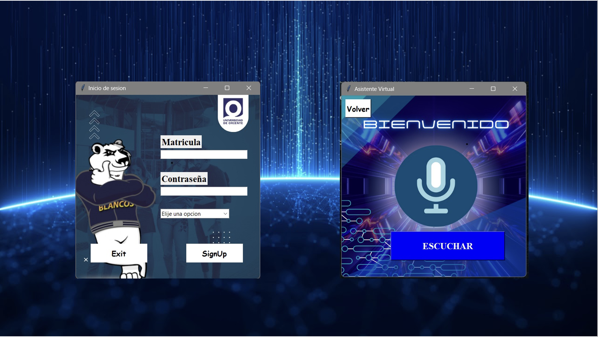

# Project oriente - Asistente personal

**Project oriente** es un asistente personal que funciona mediante comandos de voz.  
Su funcionamiento está destinado tanto para alumnos como para docentes.  
Funcionalidades básicas como reproductor de videos, mensajería, etc.  
Consultas académicas a solo una petición.  
**Agilizando el aprendizaje.**

